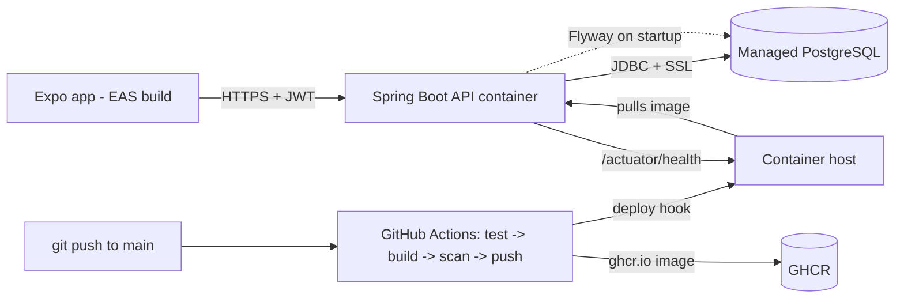

# Week 10 Homework

This is the last homework of C3, and it is not "more problems" — it is the set of capstone deliverables that are not already covered by the mini-project build itself. Each one is a concrete artifact a hiring manager or a senior reviewer will read. The full set should take about **5 hours** spread across the week. Work in your capstone repo so each deliverable is a commit you can point to.

Each problem includes a **statement**, **deliverable**, **acceptance criteria**, a **hint**, and an **estimated time**. The rubric at the bottom is how the week is graded.

---

## Problem 1 — The one-page architecture diagram

**Statement.** Draw the Crunch Tracker architecture as a single-page Mermaid diagram in `diagram.md`. Boxes are components, arrows are data flow, every arrow labeled with the protocol/payload. If it doesn't fit on one page, abstract until it does.

**Deliverable.** `diagram.md` with a Mermaid `flowchart` that renders in GitHub.

**Acceptance criteria.**

- [ ] Shows the phone, the deployed API, managed Postgres, and the CI/CD pipeline.
- [ ] Every arrow is labeled (e.g. `HTTPS + JWT`, `JDBC/SSL`, `push image`, `deploy hook`).
- [ ] The config seam (where the API URL is baked into the build) is visible.
- [ ] Renders without syntax errors in the GitHub Mermaid preview.

**Hint.** A skeleton to start from:

**Estimated time.** 40 minutes.

---

## Problem 2 — The runbook (deploy from cold)

**Statement.** Write `RUNBOOK.md` following the Lecture 2 §2.7 template: the cold-deploy prerequisites (every env var and account), the deploy command, the mobile build command, the rollback procedure (with a time), and the "first five minutes" decision tree.

**Deliverable.** `RUNBOOK.md` a stranger could follow to deploy the whole system.

**Acceptance criteria.**

- [ ] An env-var table with *every* variable the API needs (`DATABASE_URL`, `DATABASE_USER`, `DATABASE_PASSWORD`, `JWT_SECRET`, `CORS_ALLOWED_ORIGINS`, `PORT`) and where it comes from.
- [ ] The exact deploy trigger (merge to `main` / re-run pipeline) and how to confirm health.
- [ ] A one-command/one-action rollback with a stated time, and the expand/contract note.
- [ ] A "first five minutes" tree that starts at `/actuator/health` and reaches the structured logs.

**Hint.** The test of a good runbook is that someone who has never seen your project can follow it without asking you anything. Have a classmate try; the questions they ask are the gaps to fill. (Lecture 2, §2.7.)

**Estimated time.** 60 minutes.

---

## Problem 3 — The CI/CD pipeline, proven

**Statement.** Wire `exercise-02-deploy-workflow.yml` into your repo, adapt it to your host and API URL, set the secrets, and prove it works: a PR that runs tests, and a `main` push that builds, scans, pushes, deploys, and smoke-tests.

**Deliverable.** A `pipeline.md` linking the green Actions runs (one PR, one `main` deploy) and a one-paragraph description of the stages.

**Acceptance criteria.**

- [ ] A PR run shows the tests ran (green or honestly red, then fixed) and did *not* deploy.
- [ ] A `main` run shows build → scan → push → deploy → smoke, all green.
- [ ] `git grep` in the repo finds no long-lived credential (no DB password, JWT secret, or cloud key).
- [ ] The image in GHCR is tagged with the commit SHA (traceable rollback).

**Hint.** Set the host secret first: `gh secret set RENDER_DEPLOY_HOOK`. The image push needs no secret — `GITHUB_TOKEN` is built in. If the push 403s, enable `packages: write` in the repo's Actions permissions. (Exercise 2; Lecture 1, §1.9–§1.10.)

**Estimated time.** 75 minutes.

---

## Problem 4 — The installable mobile build, proven on a foreign phone

**Statement.** Produce an EAS `preview` build pointed at your live API (using the Exercise 3 config seam) and install it on a phone that has *never* been on your dev network. Sign in, create a habit, check in, and confirm the row landed in managed Postgres.

**Deliverable.** A `mobile-release.md` with the install link, a screenshot of the signed-in app, and the `psql` output showing the check-in row.

**Acceptance criteria.**

- [ ] The install link is for the `preview` (internal-distribution) build, not Expo Go.
- [ ] `EXPO_PUBLIC_API_URL` in `eas.json` is the live API host, not `localhost`/LAN.
- [ ] The app works on a phone not on your network (proving the URL is baked in correctly).
- [ ] The `check_ins` row exists in managed Postgres with `user_id` matching the signed-in user (ownership held).

**Hint.** Test on a phone on cellular (Wi-Fi off) to be certain you aren't accidentally relying on your LAN. The `config/env.ts` guard from Exercise 3 should *throw at startup* if you built with a localhost URL in a release build — that's the safety net. (Lecture 2, §2.3–§2.5; Exercise 3.)

**Estimated time.** 50 minutes.

---

## Problem 5 — The 5-minute video + portfolio writeup

**Statement.** Two short deliverables. (a) Record a ≤5-minute video tracing one check-in from the tap to the database row (the Lecture 2 §2.6 walk). (b) Write the one-paragraph portfolio writeup with the live-demo link.

**Deliverable.** `portfolio.md` containing the writeup and the video link.

**Acceptance criteria.**

- [ ] The video is under 5 minutes and traces one real check-in end to end, naming the mechanism at each hop (JWT, ownership, Flyway-built schema, the row).
- [ ] It shows the *live* deployed system, not localhost (the install link and the public health endpoint are visible).
- [ ] The writeup names the stack precisely, states what *you* did in the first person, and links a live, installable artifact.
- [ ] No placeholder text — a real link, a real paragraph.

**Hint.** People read ~150 words/minute, so 5 minutes is ~750 words — rehearse the script out loud once and cut ruthlessly. Have a recorded fallback of a successful trace in case the live demo hiccups. (Lecture 2, §2.6, §2.9.)

**Estimated time.** 50 minutes.

---

## Problem 6 — The "known limitations" section + mock-interview retro

**Statement.** Two short writing tasks. (a) Write the "Known limitations and next steps" section of your README: the three things you'd fix before this took real traffic, in priority order, each with why. (b) After your mock interview, write a half-page retrospective: the two questions you answered well, the one you fumbled, and what you'd say differently.

**Deliverable.** The README's "Known limitations" section and `mock-interview-retro.md`.

**Acceptance criteria.**

- [ ] At least three honest, prioritized limitations (e.g. single-region DB is the SPOF; no refresh-token rotation; no rate limiting on auth), each with a one-line reason and a rough fix.
- [ ] The limitations are real and specific — not "could add more tests."
- [ ] The mock-interview retro names two strengths, one fumble, and a concrete fix for the fumble.
- [ ] Both are honest — a retro that says "I nailed everything" fails this problem.

**Hint.** Naming your own biggest risk before anyone asks is the single most senior move you make all week. Hiring managers read the limitations section first; it's where they learn whether you can think. (Lecture 2, §2.8, §2.10.)

**Estimated time.** 45 minutes.

---

## Rubric

Graded out of 100. This homework is the deliverable scaffolding for the capstone, so the weights mirror the capstone's emphasis.

| Problem | Artifact | Points | What earns full marks |
|---|---|---:|---|
| 1 | `diagram.md` | 15 | One page, all components, every arrow labeled, renders in GitHub. |
| 2 | `RUNBOOK.md` | 20 | Full env-var table, deploy + rollback, "first five minutes" tree; a stranger could follow it. |
| 3 | `pipeline.md` | 20 | Green PR (tests only) + green `main` (build→scan→push→deploy→smoke); no credential in repo. |
| 4 | `mobile-release.md` | 20 | Installable `preview` build pointed at live API; works off-network; check-in row, user-scoped. |
| 5 | `portfolio.md` | 15 | Timed <5-min trace video of the live system + precise, first-person writeup with a live link. |
| 6 | limitations + retro | 10 | Three honest prioritized limitations + an honest mock-interview retro with a fix. |

**Passing the week** requires >=70 on this rubric *and* a capstone that deploys from a clean clone and runs end to end (the mini-project / Challenge 1 gate). The two are scored together; a perfect homework with a system that only runs on your laptop does not pass.

**Deductions.** Any long-lived credential found in the repo: −20 and a required fix. A shipped mobile build pointed at `localhost`/LAN: −20 and a required fix. A runbook that omits a step the deploy actually needs (so a stranger gets stuck): −10. A portfolio writeup that links a dead or localhost-only demo: −10. These are the production-shop non-negotiables; the deductions are deliberately harsh because in a real shop they are incidents.
